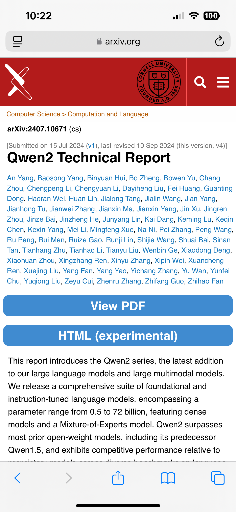
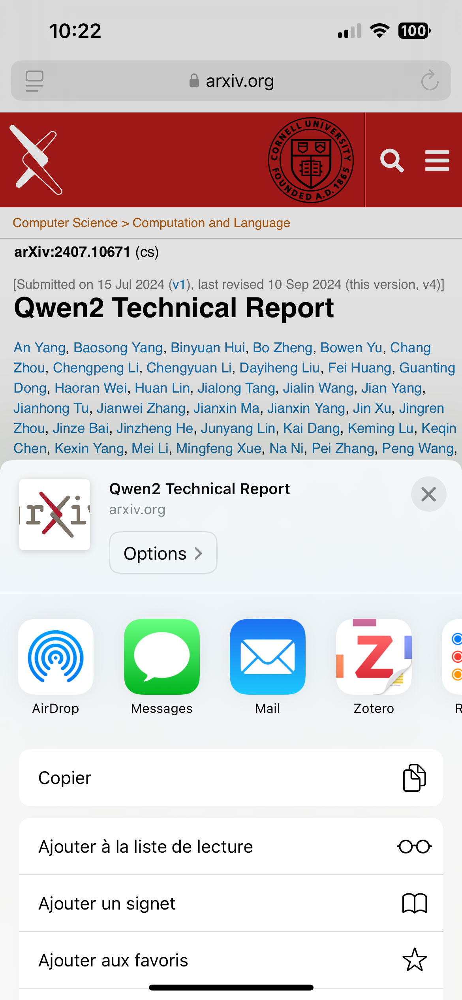
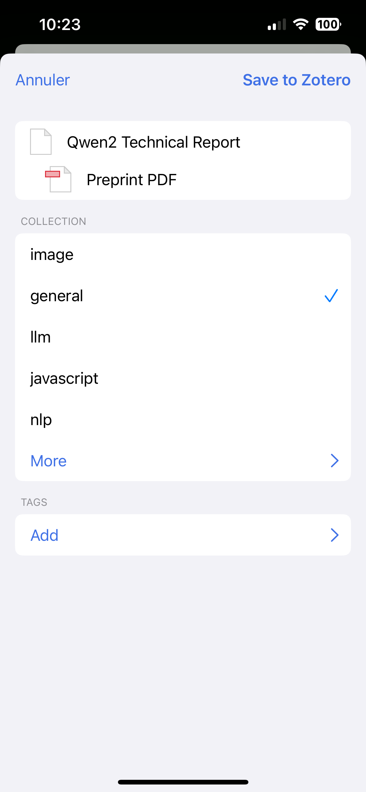

<div align="center">

# Knowledge

</div>

<p align="center">
<a href="https://knowledge-web.org"><strong>Personal Knowledge Base</strong></a>
</p>

<p align="center">

</p>

**Knowledge** fetches bookmarks and interactions from **GitHub**, **HackerNews**, **Zotero**, **HuggingFace**, and **X/Twitter**, then organizes them into a folder tree and serves them through a [ColBERT](https://github.com/lightonai/pylate-rs) search engine.

Live instance: [knowledge-web.org](https://knowledge-web.org)

---

## Architecture

```
                        ┌──────────────────────────────────────────────────────┐
                        │              Rust API  (:8080)                       │
  Browser               │                                                      │
  Extension ──POST──────┤►  /api/bookmark  (ingest)                            │
                        │►  /indices/*/search_with_encoding  (ColBERT search)  │
  Frontend  ──GET/POST──┤►  /api/folder_tree, /api/sources, /api/favorites     │
  (:3000)               │►  /events, /stats/*  (analytics)                     │
                        │                                                      │
                        │   Buffer Scanner (background)                        │
                        │     scans buffer/ → encode → index → PG upsert       │
                        │     → rescue placement into folder tree              │
                        └──────────────┬───────────────────────────────────────┘
                                       │
             ┌─────────────────────────┼─────────────────────────┐
             ▼                         ▼                         ▼
      ┌─────────────┐     ┌───────────────────┐     ┌──────────────────┐
      │  PostgreSQL  │     │ ColBERT Index      │     │  buffer/         │
      │  documents   │     │ multi-vector-      │     │  (JSON batches)  │
      │  folder_tree │     │ database/          │     │                  │
      │  favorites   │     │                    │     └──────────────────┘
      │  events      │     └───────────────────┘               ▲
      └─────────────┘                                          │
             ▲                                                 │
             │           ┌──────────────────────────────┐      │
             └───────────┤  Python Pipeline (make run)  ├──────┘
                         │  fetch → clean → tag → tree  │
                         │  → write buffer/             │
                         │  → rescue placement          │
                         └──────────────────────────────┘
```

**Two paths to get documents indexed and placed:**

| Path | Trigger | What happens |
|------|---------|-------------|
| **Full pipeline** | `make run` | Python fetches all sources, rebuilds tags, builds folder tree (Louvain clustering + model2vec), writes new docs to `buffer/`, rescue-places any stragglers |
| **Buffer scanner** | Automatic (every 30s) | Rust API picks up `buffer/*.json`, ColBERT-encodes them, updates the search index, upserts to PG, rescue-places into the existing folder tree |

The browser extension (`POST /api/bookmark`) follows a third path: the API immediately encodes, indexes, and upserts the bookmark, then the next buffer scanner cycle rescue-places it.

---

## Project Layout

```
sources/              Python package — data fetchers and pipeline
  client.py             main pipeline orchestrator
  taxonomy.py           folder tree builder (Louvain + model2vec clustering)
  database.py           PostgreSQL abstraction layer
  github.py, hackernews.py, zotero.py, huggingface.py, twitter.py

api/                  Unified Rust API (single binary)
  src/
    main.rs             server startup, routing, CLI args
    handlers/
      buffer.rs         background buffer scanner
      rescue.rs         folder tree placement (tag matching)
      ingest.rs         POST /api/bookmark handler
      data.rs           folder_tree, sources, favorites endpoints
      search.rs         ColBERT search endpoints
      events.rs         analytics ingestion and stats
      documents.rs      index CRUD
      encode.rs         text encoding endpoint
      rerank.rs         ColBERT reranking
      metadata.rs       index metadata queries
    state.rs            AppState, model pool, index management
    db.rs               PG migrations

embeddings/           Rust binary — builds the ColBERT index from PG
web/                  Static frontend (HTML, JSX, CSS, WASM worker)
scripts/              Utility scripts
  rescue_placement.py   standalone rescue placement (make rescue)
  migrate_json_to_pg.py JSON → PostgreSQL migration

run.py                Thin entry point (calls sources.client.main())
sources.yml           Source configuration (which accounts to fetch)
Makefile              All operations
```

---

## Data Flow

### 1. Fetch & Process (`make run`)

The Python pipeline fetches documents from all configured sources, merges them into the database, generates tags, and builds the folder tree:

```
GitHub stars ─┐
HN upvotes ──┤
Zotero ──────┼──► merge into PG ──► generate tags ──► build folder tree
HuggingFace ─┤                                         (Louvain + model2vec)
X/Twitter ───┘                                              │
                                                            ▼
                                              write new docs to buffer/
                                                            │
                                                            ▼
                                              rescue-place any unplaced docs
```

### 2. Index (`buffer scanner` or `make index`)

New documents in `buffer/` are picked up by the Rust API's background scanner:

1. **Parse** — read the JSON batch file
2. **Encode** — ColBERT multi-vector embeddings (`answerai-colbert-small-v1`)
3. **Index** — append to the mmap index (`multi-vector-database/`)
4. **Upsert** — write document metadata to PostgreSQL
5. **Rescue** — place docs into the folder tree via tag matching
6. **Cleanup** — delete the processed batch file

### 3. Rescue Placement

New documents need to appear in the folder tree immediately, without waiting for a full tree rebuild. The rescue step:

- **In Rust** (buffer scanner): matches document tags against leaf tag names using exact match and word overlap. Runs automatically after each buffer scan.
- **In Python** (`make run` / `make rescue`): uses model2vec embedding similarity between document titles and leaf tag names. Runs at the end of the pipeline or standalone.

Both are idempotent — running them multiple times won't duplicate entries.

### 4. Search

The frontend sends queries to `/indices/knowledge/search_with_encoding`. The API:

1. Encodes the query with ColBERT
2. Searches the mmap index (MaxSim scoring)
3. Returns ranked results with metadata

Filtering by source, folder, or favorites is supported via `/indices/knowledge/search/filtered_with_encoding`.

---

## Makefile Commands

### Pipeline

```sh
make run              # fetch all sources → tags → tree → buffer (full pipeline)
make rescue           # place unplaced docs into folder tree (standalone, fast)
make index            # rebuild the ColBERT index from PG (full re-index)
```

### Serve

```sh
make serve            # start the Rust API on :8080
make web              # serve the frontend on :3000
make up               # start all services via Docker Compose (local dev)
make down             # stop all local services
```

### Database

```sh
make db               # start PostgreSQL only
make migrate          # one-time JSON → PostgreSQL migration
```

### Production (Hetzner VPS)

```sh
make deploy           # start production stack (Caddy + API + PG)
make deploy-build     # rebuild + start production stack
make deploy-down      # stop production stack
make deploy-logs      # view production logs
make redeploy         # git push → pull on server → rebuild → stream logs
```

### Remote Server

```sh
make ssh              # SSH into the server
make remote-status    # show container status
make remote-logs      # stream server logs
make remote-restart   # restart all services
make remote-update    # pull latest code + rebuild
```

### Development

```sh
make install          # install prod dependencies
make install-dev      # install with dev tools (ruff, mypy, pre-commit)
make lint             # ruff + mypy
make lint-fix         # auto-fix lint issues
make clean            # wipe caches and venv
```

---

## Getting Started

### 1. Fork & Clone

Fork this repository and clone it locally.

### 2. Configure Sources

Edit `sources.yml` to specify which accounts to fetch:

```yml
github:
  - "raphaelsty"

twitter:
  username: "raphaelsrty"
  min_likes: 10
  max_pages: 2

huggingface: True
```

### 3. Set Credentials

Create a `.env` file or set environment variables:

| Variable | Service | Required |
|----------|---------|----------|
| `ZOTERO_API_KEY` | [Zotero](https://www.zotero.org/settings/keys) | Optional |
| `ZOTERO_LIBRARY_ID` | Zotero | Optional |
| `HACKERNEWS_USERNAME` | [HackerNews](https://news.ycombinator.com) | Optional |
| `HACKERNEWS_PASSWORD` | HackerNews | Optional |
| `HUGGINGFACE_TOKEN` | [HuggingFace](https://huggingface.co/settings/tokens) | Optional |
| `TWITTER_AUTH_TOKEN` | [X/Twitter](https://x.com) | Optional |
| `TWITTER_CT0` | X/Twitter | Optional |

### 4. Run Locally

```sh
make install          # install dependencies
make up               # start PostgreSQL + API + web via Docker Compose
make run              # fetch sources and build the database
```

The frontend is at `http://localhost:3000`, the API at `http://localhost:8080`.

### 5. Deploy to Production

The recommended setup is Docker Compose on a VPS (e.g., Hetzner CX33: 4 vCPU, 8GB RAM).

1. Point your domain's DNS A record to the server IP.
2. Clone the repository on the server.
3. Run:
   ```sh
   DOMAIN=your-domain.com POSTGRES_PASSWORD=a-strong-password make deploy-build
   ```

Caddy handles HTTPS automatically via Let's Encrypt.

---

## Production Stack

```
Internet
  │
  ▼
Caddy (reverse proxy + auto HTTPS)
  ├─ /indices/*, /api/*, /events, /stats/* ──► knowledge-api (:8080)
  └─ /* (static files) ──► web/ directory
                                │
knowledge-api ◄─────────────────┘
  ├─ ColBERT search index (mmap, in-memory)
  ├─ ONNX model (answerai-colbert-small-v1, INT8)
  ├─ Buffer scanner (background, every 30s)
  └─ PostgreSQL connection
       ├─ documents table
       ├─ generated_data (folder_tree, sources)
       ├─ favorites
       └─ events (analytics, 90-day retention)
```

---

## Integrations

### Zotero

Save papers and articles via the Zotero browser extension or mobile app. Documents sync to your Zotero library and get indexed on the next pipeline run.

<div style="display: flex; justify-content: space-around; align-items: center; gap: 10px;">



</div>

### Browser Extension

The included browser extension (`extension/`) adds a one-click button to save any page as a bookmark. It sends a `POST /api/bookmark` to the API, which immediately indexes it for search. The buffer scanner then places it in the folder tree.

Build the extension zip: `make extension`

### X/Twitter

> Optional — remove the `twitter` block from `sources.yml` to skip.

Fetches bookmarked and liked tweets using browser cookies (no paid API key needed).

**Getting cookies:**

1. Log into [x.com](https://x.com) in your browser.
2. Open DevTools (F12) → **Application** → **Cookies** → `https://x.com`.
3. Copy `auth_token` and `ct0` values.
4. Set them as `TWITTER_AUTH_TOKEN` and `TWITTER_CT0`.

On macOS with Safari, cookies are extracted automatically when running locally.

The `auth_token` cookie lasts about a year. When it expires, grab fresh cookies and update.

**Configuration in `sources.yml`:**

```yml
twitter:
  username: "your_handle"
  min_likes: 10    # minimum likes for bookmarked tweets
  max_pages: 2     # pages of recent likes (~100/page)
```

---

## API Endpoints

### Search

| Method | Path | Description |
|--------|------|-------------|
| POST | `/indices/{name}/search_with_encoding` | Search with auto-encoding |
| POST | `/indices/{name}/search/filtered_with_encoding` | Filtered search |
| POST | `/indices/{name}/search` | Search with pre-computed embeddings |
| POST | `/encode` | Encode text to embeddings |
| POST | `/rerank` | Rerank results with ColBERT MaxSim |

### Data

| Method | Path | Description |
|--------|------|-------------|
| GET | `/api/folder_tree` | Folder tree structure |
| GET | `/api/sources` | Source filter list |
| GET | `/api/favorites` | Favorited URLs |
| POST | `/api/favorites` | Toggle favorite |

### Ingest

| Method | Path | Description |
|--------|------|-------------|
| POST | `/api/bookmark` | Ingest a single bookmark (encode + index + PG) |

### Pipeline

| Method | Path | Description |
|--------|------|-------------|
| POST | `/api/pipeline` | Trigger the Python pipeline (`run.py`) |
| GET | `/api/pipeline` | Pipeline status (idle/running) and last run result |

### Analytics

| Method | Path | Description |
|--------|------|-------------|
| POST | `/events` | Batch event ingestion |
| GET | `/stats/overview` | Analytics overview |
| GET | `/stats/activity` | Activity over time |
| GET | `/stats/top-queries` | Top search queries |
| GET | `/stats/top-clicks` | Top clicked URLs |
| GET | `/stats/sources` | Source filter usage |
| GET | `/stats/folders` | Folder browse counts |

### Index Management

| Method | Path | Description |
|--------|------|-------------|
| GET | `/health` | Health check with index info |
| GET | `/indices` | List all indices |
| GET | `/indices/{name}` | Index info |
| POST | `/indices` | Create index |
| DELETE | `/indices/{name}` | Delete index |

Swagger UI available at `/swagger-ui`.

---

## License

This project is licensed under the [PolyForm Noncommercial License 1.0.0](https://polyformproject.org/licenses/noncommercial/1.0.0/) with an **attribution requirement**.

You may use, modify, and distribute this software for any **noncommercial** purpose — personal use, research, education, hobby projects. Commercial use (including reselling, offering as a paid service, or incorporating into commercial products) is not permitted without separate agreement.

**Attribution is required.** Any work that uses or derives from this software must give clear, visible credit to the original project:

> Built with [Knowledge](https://github.com/raphaelsty/knowledge) by Raphael Sourty.

See [LICENSE](LICENSE) for the full terms.

Knowledge Copyright (C) 2023-2025 Raphael Sourty
