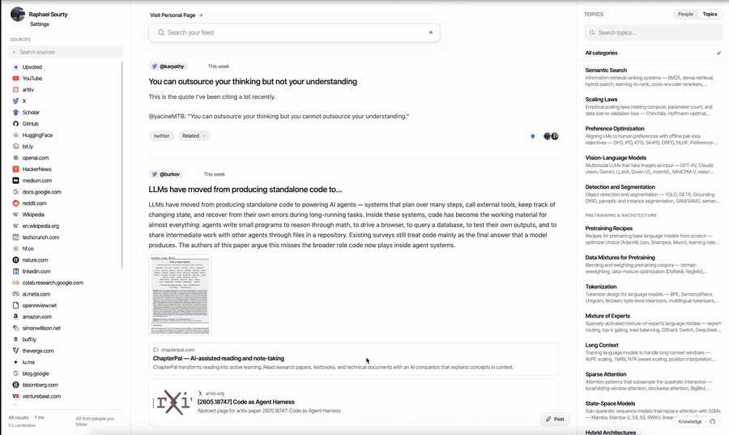

<p align="center">
  <a href="https://knowledge-web.org"></a>
</p>

<p align="center">
  
</p>

<p align="justify">
Knowledge is a personal library. A place to keep what you found interesting on GitHub, on X, in a blog, in a paper, and to read it when you have time. A talk that mattered last week is still worth watching this week. A paper from two months ago still teaches you what you came for. Build your own library, or sit in someone else's for an hour. Spend that hour with Andrej Karpathy's bookmarks and you learn what fifteen years of ML looks like.
</p>

<p align="justify">
Tap the heart on any card and the doc lands in your library, indexed and searchable. Every contributor has a personal page that reads like a curated bookshelf: their tweets, their stars, the papers they wrote, the videos they show up in. Browse it the way you'd browse a friend's bookmarks folder.
</p>

<p align="justify">
Type a query. ColBERT searches the actual contents of every doc, not just titles, and ranks them by how well the words match. Search one library, several at once, or the whole shared corpus.
</p>

<p align="justify">
GitHub, X, Hacker News, Reddit, Stack Overflow, Hugging Face, arXiv, Google Scholar, DBLP, Zotero, YouTube, plus any blog with an RSS feed or sitemap.
</p>

<p align="justify">
The API exposes an MCP server at <code>/mcp</code> with fifteen tools: <code>search</code>, <code>latest</code>, <code>find_similar</code>, <code>intersect_documents</code>, <code>feed</code>, plus bearer-authed <code>my_library</code>, <code>my_timeline</code>, and <code>save_document</code>.
</p>

<p align="justify">
Knowledge has always been a showcase for the information retrieval tools I'm building. It started 4 years ago on a cherche backend and now runs on next-plaid and pylate-rs. The frontend is plain HTML and JS, with a ColBERT WASM worker for re-ranking. The API is a single Rust binary, the pipeline is Python. Everything runs on a single Hetzner VPS. So yes, when you type a query, a quantized ColBERT runs on the server's CPU against a next-plaid index — and then on your phone, an unquantized ColBERT running in WASM re-ranks the results.
</p>

## Citation

```bibtex
@software{sourty2026knowledge,
  author  = {Sourty, Raphaël},
  title   = {Knowledge: a library for the internet},
  year    = {2026},
  url     = {https://github.com/raphaelsty/knowledge},
  license = {PolyForm-Noncommercial-1.0.0}
}
```
