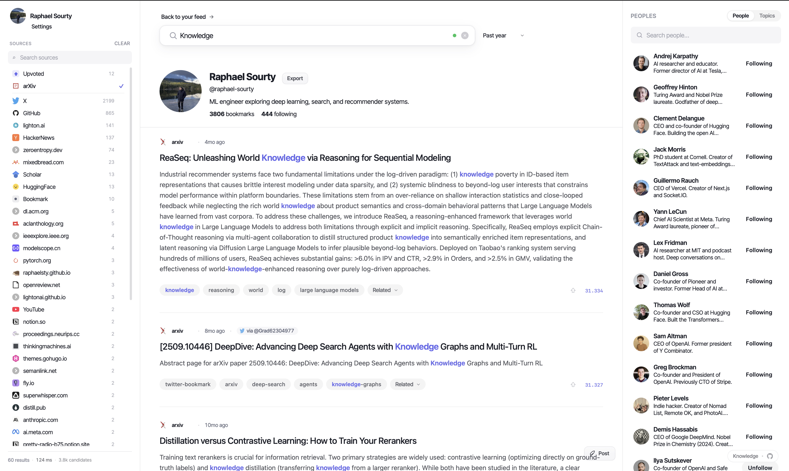
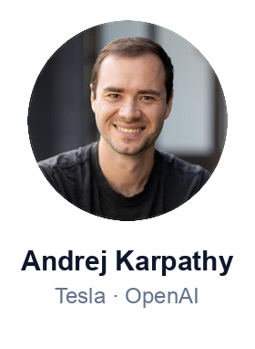
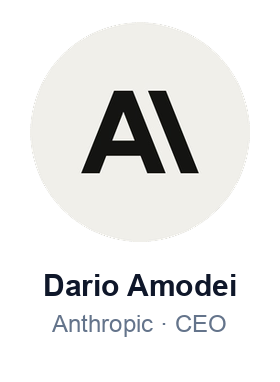
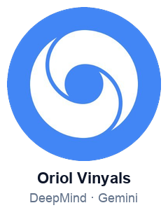
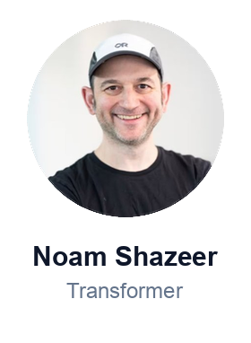
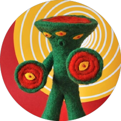
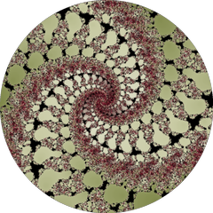

<p align="center">
  <a href="https://knowledge-web.org"></a>
</p>

<p align="center"><em>A biased Feed.</em></p>

<p align="center">An opinionated reading list of <strong>454 people</strong> who shape AI, science, and software today. A place to learn.</p>

<p align="center"><em>No ads, no algorithm, no infinite scroll. Just what they read.</em></p>

<br>

<p align="center">
  
</p>

<br>

<p align="justify">
Knowledge is a <a href="https://knowledge-web.org"><em>personal library</em></a>. A place to keep what you found interesting on GitHub, on X, in a blog, in a paper, and to read it when you have time. A talk that mattered last week is still worth watching this week. A paper from two months ago still teaches you what you came for. Build your own library, or sit in someone else's for an hour. Spend that hour with Andrej Karpathy's bookmarks and you learn what <em>fifteen years of ML</em> looks like.
</p>

<br>

<p align="justify">
Tap the heart on any card and the doc lands in your library, indexed and searchable. Every contributor has a personal page that reads like a curated bookshelf: their tweets, their stars, the papers they wrote, the videos they show up in. Browse it the way you'd browse a friend's bookmarks folder.
</p>

<br>

<h2 align="center">Libraries to visit</h2>

<p align="center">A few rooms worth walking into.</p>

<p align="center">
<a href="https://knowledge-web.org/geoffrey-hinton" title="Geoffrey Hinton"></a>
<a href="https://knowledge-web.org/yoshua-bengio" title="Yoshua Bengio"></a>
<a href="https://knowledge-web.org/yann-lecun" title="Yann LeCun"></a>
<a href="https://knowledge-web.org/andrej-karpathy" title="Andrej Karpathy"></a>
<a href="https://knowledge-web.org/ian-goodfellow" title="Ian Goodfellow"></a>
</p>

<p align="center">
<a href="https://knowledge-web.org/ilya-sutskever" title="Ilya Sutskever"></a>
<a href="https://knowledge-web.org/demis-hassabis" title="Demis Hassabis"></a>
<a href="https://knowledge-web.org/dario-amodei" title="Dario Amodei"></a>
<a href="https://knowledge-web.org/oriol-vinyals" title="Oriol Vinyals"></a>
<a href="https://knowledge-web.org/noam-shazeer" title="Noam Shazeer"></a>
</p>

<p align="center">
<a href="https://knowledge-web.org/omar-khattab" title="Omar Khattab"></a>
<a href="https://knowledge-web.org/matei-zaharia" title="Matei Zaharia"></a>
<a href="https://knowledge-web.org/francois-chollet" title="François Chollet"></a>
<a href="https://knowledge-web.org/clement-delangue" title="Clément Delangue"></a>
<a href="https://knowledge-web.org/thomas-wolf" title="Thomas Wolf"></a>
</p>

<p align="center">
<a href="https://knowledge-web.org/chris-olah" title="Chris Olah"></a>
<a href="https://knowledge-web.org/sebastian-raschka" title="Sebastian Raschka"></a>
<a href="https://knowledge-web.org/max-halford" title="Max Halford"></a>
<a href="https://knowledge-web.org/pieter-levels" title="Pieter Levels"></a>
<a href="https://knowledge-web.org/lex-fridman" title="Lex Fridman"></a>
</p>

<p align="center">…or wander through <a href="https://knowledge-web.org">all 454 libraries</a>.</p>

<br>

<h2>Search</h2>

<p align="justify">
Type a query. ColBERT searches the actual contents of every doc, not just titles, and ranks them by how well the words match. Search one library, several at once, or the whole shared corpus.
</p>

<br>

<h2>MCP</h2>

<p align="justify">
The API exposes an MCP server at <code>/mcp</code> with fifteen tools. Twelve are public, three require a bearer token you mint at <a href="https://knowledge-web.org/profile"><code>/profile</code></a>.
</p>

<table>
<tr>
<td valign="top">

<strong>Search & discover</strong>

<ul>
<li><code>search</code>: query a single library</li>
<li><code>search_across</code>: query several libraries at once</li>
<li><code>search_personalities</code>: find libraries by description</li>
<li><code>find_similar</code>: docs related to one you've read</li>
<li><code>latest</code>: most recent docs in a library</li>
<li><code>feed</code>: chronological cross-library feed</li>
<li><code>intersect_documents</code>: docs shared between libraries</li>
</ul>

</td>
<td valign="top">

<strong>Catalog</strong>

<ul>
<li><code>list_personalities</code>: every library</li>
<li><code>list_sources</code>: sources for a library</li>
<li><code>list_tags</code>: tags for a library</li>
<li><code>get_personality</code>: one library's metadata</li>
<li><code>get_document</code>: one doc by URL</li>
</ul>

<strong>Authenticated</strong>

<ul>
<li><code>my_library</code>: your saved docs</li>
<li><code>my_timeline</code>: your activity feed</li>
<li><code>save_document</code>: save a doc to your library</li>
</ul>

</td>
</tr>
</table>

```bash
claude mcp add knowledge --transport http https://knowledge-web.org/mcp \
  --header "Authorization: Bearer kn_..."
```

<br>

<h2>How it works</h2>

<p align="justify">
The pipeline runs all day, walking through each personality's sources in a continuous loop: GitHub stars, X posts, Hacker News submissions, arXiv papers, Hugging Face likes, Reddit, Stack Overflow, Wikipedia, the rest of it. Each document gets cleaned, tagged, written to Postgres. A separate indexer daemon picks up new rows and embeds them with ColBERT, so search stays current without blocking the main pipeline. When you type a query, the API serves ranked results from a next-plaid PLAID index sitting on local disk. Your browser does a second pass with an unquantized ColBERT running in WASM to re-rank what landed. Soup to nuts the whole stack lives in this repo: <code>sources/</code> is Python (fetchers and orchestrator), <code>api/</code> is Rust (search, ingest, auth, MCP), <code>web/</code> is plain HTML and JS.
</p>

<br>

<h2>Why it helps</h2>

<p align="justify">
Most platforms compete for your attention with infinite feeds, ads between every post, notifications you didn't ask for, recommendations from an algorithm that learned to manipulate you. Knowledge does the opposite: small, finite libraries you can return to. Use it to research a topic across experts. Search 454 libraries at once for "speculative decoding" and you get curated context instead of random Google noise. Browse Karpathy's GitHub stars, Yann LeCun's papers, Geoffrey Hinton's interviews, all in one place. Stop doomscrolling X. The site compresses someone's year of tweets into a static page you can read once and close. Sign in to save what matters, search your own library, mint a token to wire the MCP server into Claude, Cursor, or any agent that speaks MCP.
</p>

<br>

<h2>Under the hood</h2>

<p align="justify">
Knowledge has always been a showcase for the information retrieval tools I'm building. It started four years ago on a <a href="https://github.com/raphaelsty/cherche"><em>cherche</em></a> backend and now runs on <a href="https://github.com/lightonai/next-plaid"><em>next-plaid</em></a> and <a href="https://github.com/lightonai/pylate-rs"><em>pylate-rs</em></a>, the same search stack behind <a href="https://github.com/lightonai/next-plaid/tree/main/colgrep"><em>ColGREP</em></a>, the semantic code-search tool. The API is a single Rust binary, the pipeline is Python, the frontend is plain HTML and JS. Everything runs on a single Hetzner VPS.
</p>

<br>

<p align="justify">
The pipeline parses about a dozen sources: GitHub stars, X posts and likes, Hacker News submissions and comments, arXiv, Google Scholar, DBLP, Hugging Face likes, YouTube channels, Zotero libraries, Reddit, Stack Overflow, Wikipedia references, plus any blog you can point at via RSS or sitemap. As of today that's <strong>454 personal libraries</strong>, around <strong>440,000 documents</strong> indexed.
</p>

<br>

<p align="justify">
So yes, when you type a query a quantized ColBERT runs on the server's CPU against a next-plaid index, and then on your phone an unquantized ColBERT in WASM re-ranks the results. The browser-side full-precision re-rank is, as far as I know, an original trick.
</p>

<br>

<h2>Cost and hosting</h2>

<p align="justify">
Free to use, free to read. The whole site runs on a single <a href="https://www.hetzner.com/cloud">Hetzner CX33</a> in Helsinki: 4 vCPUs, 8 GB RAM, around <strong>$15 a month</strong> all in. No CDN, no managed Postgres, no Cloudflare proxy in front of the app. The 3.8 GB ColBERT index sits on local disk and the API serves it directly. To self-host you clone the repo, set five env vars, point a domain at the box, push to main. PolyForm Noncommercial 1.0.0 covers personal and educational use.
</p>

<br>

<h2>License</h2>

<p align="justify">
<a href="LICENSE">PolyForm Noncommercial 1.0.0</a>. Free to use, modify, and self-host for non-commercial purposes. <a href="mailto:raphael.sourty@lighton.ai">Get in touch</a> for anything else.
</p>

<br>

<h2>Citation</h2>

```bibtex
@software{sourty2026knowledge,
  author  = {Sourty, Raphaël},
  title   = {Knowledge: a library for the internet},
  year    = {2026},
  url     = {https://github.com/raphaelsty/knowledge},
  license = {PolyForm-Noncommercial-1.0.0}
}
```
