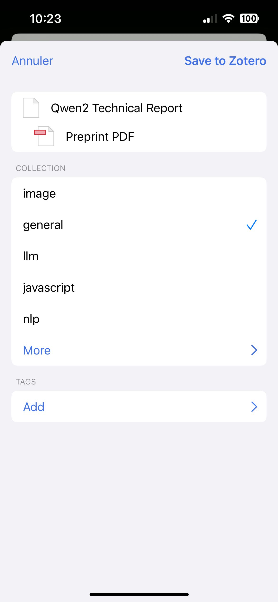

<div align="center">

# Knowledge

</div>

<p align="center">
<a href="https://raphaelsty.github.io/knowledge/"><strong>Personal Knowledge Base</strong></a>
</p>

<p align="center">

</p>

**Knowledge** is a web application that automatically transforms the digital footprint into a personal search engine. It fetches content you interact with from various platforms—**GitHub**, **HackerNews**, and **Zotero**—and organizes it into a navigable knowledge graph.

---

## 🌟 Features

- **🤖 Automatic Aggregation:** Daily, automated extraction of GitHub stars, HackerNews upvotes, and Zotero library.

- **🔍 Powerful Search:** A built-in search engine to instantly find any item you've saved or interacted with.

- **🕸️ Knowledge Graph:** Navigate bookmarks through a graph of automatically extracted topics and their connections.

My Personal Knowledge Base is available at [raphaelsty.github.io/knowledge](https://raphaelsty.github.io/knowledge/).

---

## 🛠️ How It Works

A GitHub Actions workflow runs twice a day to perform the following tasks:

1.  **Extracts Content** from specified accounts:
    - GitHub Stars
    - HackerNews Upvotes
    - Zotero Records
2.  **Processes and Stores Data** in the `database/` directory:
    - `database.json`: Contains all the raw records.
    - `triples.json`: Stores the knowledge graph data (topics and relationships).
    - `retriever.pkl`: The serialized search engine model.
3.  **Deploys Updates**:
    - The backend API is automatically updated and pushed to the Fly.io instance.
    - The frontend on GitHub Pages is refreshed with the latest data.

The backend is built with FastAPI and deployed on Fly.io, which offers a free tier suitable for this project. The frontend is a static site hosted on GitHub Pages. The search engine is powered by multiple [cherche](https://github.com/raphaelsty/cherche) lexical models and features a final [pylate-rs](https://github.com/lightonai/pylate-rs) model, which is compiled from Rust to WebAssembly (WASM) to run directly in the client's browser.

## 🚀 Getting Started: Installation & Deployment

Follow these steps to deploy your own instance of Knowledge.

### 1\. Fork & Clone

First, fork this repository to your own GitHub account and then clone it to your local machine.

### 2\. Configuration

#### A. Configure Secrets

The application requires API keys and credentials to function. These must be set as **Repository secrets** in your forked repository's settings (`Settings` > `Secrets and variables` > `Actions`).

<br>

<table style="width:100%; border-collapse: collapse;">
<thead>
<tr>
<th style="text-align:left; padding:8px; border-bottom: 1px solid \#ddd;">Secret</th>
<th style="text-align:left; padding:8px; border-bottom: 1px solid \#ddd;">Service</th>
<th style="text-align:center; padding:8px; border-bottom: 1px solid \#ddd;">Required</th>
<th style="text-align:left; padding:8px; border-bottom: 1px solid \#ddd;">Description</th>
</tr>
</thead>
<tbody>
<tr>
<td style="padding:8px; border-bottom: 1px solid \#ddd;"><code>FLY_API_TOKEN</code></td>
<td style="padding:8px; border-bottom: 1px solid \#ddd;"><a href="https://fly.io">Fly.io</a></td>
<td style="text-align:center; padding:8px; border-bottom: 1px solid \#ddd;">Yes</td>
<td style="padding:8px; border-bottom: 1px solid \#ddd;">Allows the GitHub Action to deploy your application. See the Fly.io section for instructions.</td>
</tr>
<tr>
<td style="padding:8px; border-bottom: 1px solid \#ddd;"><code>ZOTERO_API_KEY</code></td>
<td style="padding:8px; border-bottom: 1px solid \#ddd;"><a href="https://www.zotero.org/settings/keys">Zotero Settings</a></td>
<td style="text-align:center; padding:8px; border-bottom: 1px solid \#ddd;">Optional</td>
<td style="padding:8px; border-bottom: 1px solid \#ddd;">An API key to access your Zotero library.</td>
</tr>
<tr>
<td style="padding:8px; border-bottom: 1px solid \#ddd;"><code>ZOTERO_LIBRARY_ID</code></td>
<td style="padding:8px; border-bottom: 1px solid \#ddd;"><a href="https://www.zotero.org">Zotero</a></td>
<td style="text-align:center; padding:8px; border-bottom: 1px solid \#ddd;">Optional</td>
<td style="padding:8px; border-bottom: 1px solid \#ddd;">The ID of the Zotero group library you want to index.</td>
</tr>
<tr>
<td style="padding:8px; border-bottom: 1px solid \#ddd;"><code>HACKERNEWS_USERNAME</code></td>
<td style="padding:8px; border-bottom: 1px solid \#ddd;"><a href="https://news.ycombinator.com">Hacker News</a></td>
<td style="text-align:center; padding:8px; border-bottom: 1px solid \#ddd;">Optional</td>
<td style="padding:8px; border-bottom: 1px solid \#ddd;">HackerNews username to fetch upvoted posts.</td>
</tr>
<tr>
<td style="padding:8px;"><code>HACKERNEWS_PASSWORD</code></td>
<td style="padding:8px;"><a href="https://news.ycombinator.com/">Hacker News</a></td>
<td style="text-align:center; padding:8px;">Optional</td>
<td style="padding:8px;">HackerNews password.</td>
</tr>
</tbody>
</table>

#### B. Specify Sources

Next, edit the `sources.yml` file at the root of the repository to specify which GitHub users' starred repositories you want to track.

```yml
github:
  - "raphaelsty"
  - "gbolmier"
  - "MaxHalford"
```

### 3\. Deployment

#### A. Deploy the API to Fly.io

1.  **Install `flyctl`**, the Fly.io command-line tool. Instructions can be found [here](https://fly.io/docs/hands-on/install-flyctl/).
2.  **Sign up and log in** to Fly.io via the command line:
    ```sh
    flyctl auth signup
    flyctl auth login
    ```
3.  **Get API token** and add it to your GitHub repository secrets as `FLY_API_TOKEN`:
    ```sh
    flyctl auth token
    ```
4.  **Launch the app.** Follow the [Fly.io launch documentation](https://fly.io/docs/hands-on/launch-app/). This will generate a `fly.toml` file. You won't need a database.

> ⚠️ **Update API URLs**
> After deploying, you must replace all instances of `https://knowledge.fly.dev` in the `docs/index.html` file with your own Fly.io app URL (e.g., `https://app_name.fly.dev`).

#### B. Set up GitHub Pages

1.  Go to your forked repository's settings (`Settings` > `Pages`).
2.  Under `Build and deployment`, select the **Source** as `Deploy from a branch` and choose the `main` branch with the `/docs` folder.

> ⚠️ **Update CORS Origins**
> After your GitHub Pages site is live, you must add its URL to the `origins` list in the `api/api.py` file to allow cross-origin requests.

```python
origins = [
    "https://your-github-username.github.io", # Add your GitHub Pages URL here
]
```

---

## 💸 Cost Management

This project is designed to be affordable, but you are responsible for the costs incurred on Fly.io. Here is how to keep them in check:

> ⚠️ **Bound Fly.io Concurrency**
> To prevent costs from scaling unexpectedly, define connection limits in the `fly.toml` file.

```toml
[services.concurrency]
  hard_limit = 6
  soft_limit = 3
  type = "connections"
```

> ⚠️ **Select a modest Fly.io VM**
> A small virtual machine is sufficient. A **shared-cpu-1x@1024MB** is a good starting point.

---

## 💻 Local Development

To run the API on local machine for development, simply run the following command from the root of the repository:

```sh
make launch
```

---

## 🔌 Zotero Integration

The Zotero integration allows you to save academic papers, articles, and other documents, which will then be automatically indexed by your search engine.

- **Browser Extension:** Use the Zotero Connector extension for your browser to easily save documents from the web.

- **Mobile App:** The Zotero mobile app lets you add documents on the go. Any uploads will be indexed within a few hours.

  <div style="display: flex; justify-content: space-around; align-items: center; gap: 10px;">
  
  
  
  </div>

---

## 💡 Acknowledgements

My personal Knowledge Base is inspired by and extracts resources from the Knowledge Base of François-Paul Servant, namely [Semanlink](http://www.semanlink.net/sl/home).

## 📜 License

This project is licensed under the **GNU General Public License v3.0**.

Knowledge Copyright (C) 2023 Raphaël Sourty
