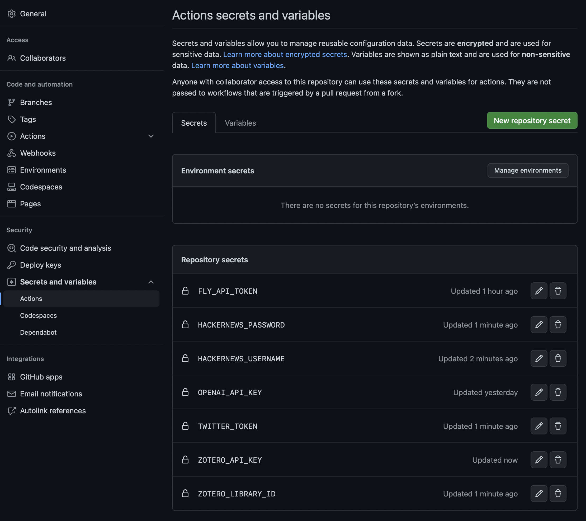
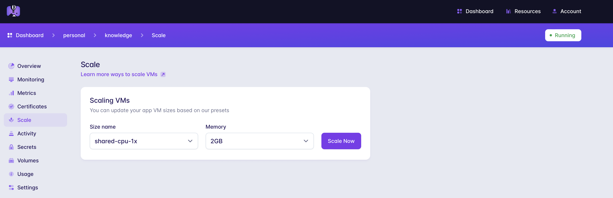
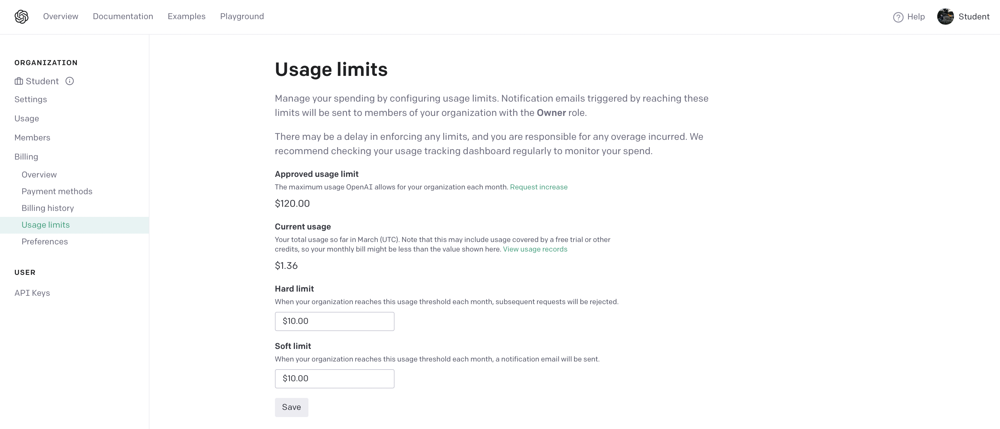

<div align="center">
  <h1>Knowledge</h1>
  <p>Personnal bookmarks</p>
</div>
<br>

<div style="text-align: justify">
<b>Knowledge</b> is a web application that automatically extract content you interact with from various social media platforms, including GitHub, HackerNews, Zotero, and Twitter. It creates a search engine, coupled with a knowledge graph that enables to navigate through documents and automatically extracted tags.
</div>

A live version of [my personal knowledge graph](https://raphaelsty.github.io/knowledge/) is available online.

<div style="text-align: justify">
The web app is hosted with Fly.io, and its GitHub action workflow calls APIs from Twitter, GitHub, HackerNews, and Zotero on a daily basis to extract content from the user's starred repositories, upvoted posts, uploaded documents, and liked tweets. The extracted content is tagged to enhance the search experience, and the updated version of the web app is pushed automatically.
</div>

### How it works

Twice a day, a dedicated github workflow extracts:

- **GitHub stars**

- **Twitter likes**

- **HackerNews upvotes**

- **Zotero records**

<div style="text-align: justify">
The data generated by the workflow of this tool is stored in various files located in the database directory. Specifically, the records are exported to the file <code>database/database.json</code>, while the knowledge graph of topics is saved in the file <code>database/triples.json</code>. Additionally, the workflow generates a search engine and saves it as <code>database/retriever.pkl</code>. Finally, the updated state of the application is pushed to the cloud provider Fly.io and the dedicated GitHub page is updated accordingly. The cost of hosting the application is under 8$ per month. It may increase if a large number of users query your bookmarks 24/7. Costs can be bounded via Fly.io and OpenAI dashboards.
</div>

<br>


<br>

### Secrets

<div style="text-align: justify">
To deploy this tool, the first step is to fork the repository and clone it locally. The next step involves defining secrets in the repository configurations (fork) for the different APIs that the system requests. The application requires several secrets to access the different APIs. While it is possible to skip some of the secrets, it is necessary to set <code>FLY_API_TOKEN</code> and <code>OPENAI_API_KEY</code>. If you do not plan to use ChatGPT, you can leave <code>OPENAI_API_KEY</code> empty. It is important to set secrets as repository secrets and not as environment secrets.
</div>



##### [Twitter](https://developer.twitter.com/en/portal/dashboard)

To extract likes, we will need a Twitter API TOKEN, available on the [Developer Portal](https://developer.twitter.com/en/portal/dashboard) after having creater an account.

```sh
TWITTER_TOKEN
```

##### [Zotero]((https://www.zotero.org))

We will need a "group library" to index content from Zotero. The `ZOTERO_API_KEY` is available at `https://www.zotero.org/settings/keys`.

```sh
ZOTERO_API_KEY
```

The `ZOTERO_LIBRARY_ID` can be found by opening the group's page `https://www.zotero.org/groups/groupname`, and hovering over the group settings link. The ID is the integer after `/groups/`.

```sh
ZOTERO_LIBRARY_ID
```

##### [Hackernews](https://news.ycombinator.com/)

We will need to create secrets for both Hackernews username and password.

```sh
HACKERNEWS_USERNAME
```

```sh
HACKERNEWS_PASSWORD
```

##### [OpenAI](https://platform.openai.com/signup)

OpenAI API is used to call ChatGPT when pressing the button "ask" to re-rank documents based on our query. If we do not plan to use ChatGPT, we will need to set the secret `OPENAI_API_KEY` with an empty value. We can get our OpenAI key [here](https://platform.openai.com/account/api-keys).

```sh
OPENAI_API_KEY
```

The prompt to ChatGPT is stored in the `api/api.py` file.


##### [Fly.io](https://fly.io)

We will need to install the flyctl client available [here](https://fly.io/docs/hands-on/install-flyctl/) to set the `FLY_API_TOKEN`. The fly.io api token enables the github action to automatically push the updated state of the api. We can get the token using the command line:

```sh
flyctl auth signup
```

```sh
fly auth login
```

```sh
flyctl auth token
```

```sh
FLY_API_TOKEN
```

### Sources

After finalizing the secrets, we can specify the Github and Twitter users whose liked content we wish to extract. To achieve this, we'll need to modify the sources.yml file located at the root of the repository. We'll be able to handpick the Github stars we want to index and set the Twitter ID and handle of the users whose content we want to include. To obtain the Twitter ID, we can use a tool like [tweeterid.com](https://tweeterid.com)."

```yml
github:
  - "raphaelsty"
  - "gbolmier"
  - "MaxHalford"
  - "AdilZouitine"

twitter:
  - [1262679654239961088, "raphaelsrty"]
```

#### Deployment

#### Fly.io

Once secrets and sources are set. We will deploy the API following the [Fly.io documentation](https://fly.io/docs/hands-on/launch-app/). You won't need any database. fly client should generate a `fly.toml` file that looks like the toml file below where `app_name` is the name of our api.

```toml
app = "app_name"
kill_signal = "SIGINT"
kill_timeout = 5
processes = []

[env]

[experimental]
  auto_rollback = true

[[services]]
  http_checks = []
  internal_port = 8080
  processes = ["app"]
  protocol = "tcp"
  script_checks = []
  [services.concurrency]
    hard_limit = 6
    soft_limit = 3
    type = "connections"

  [[services.ports]]
    force_https = true
    handlers = ["http"]
    port = 80

  [[services.ports]]
    handlers = ["tls", "http"]
    port = 443

  [[services.tcp_checks]]
    grace_period = "1s"
    interval = "15s"
    restart_limit = 0
    timeout = "2s"
```

>  ⚠️ After having created our API, we will need to update the urls called by the web app in the file `docs/index.html`. There are 3 urls to replace: `https://knowledge.fly.dev` per `https://app_name.fly.dev` where `app_name` is your API name.

##### Github Page

We will need to set the Github Page from the repository configurations (fork).


#### Costs

>  ⚠️ To avoid any financial incident, remember to define a `hard_limit` and a `soft_limit` which will bounder the number of instance Fly.io will deploy to answer to peak demands and therefore limit the costs. Those parameters are available in the `fly.toml` file.

```
[services.concurrency]
	hard_limit = 6
	soft_limit = 3
	type = "connections"
```

>  ⚠️ Setting a 2GB memory VM with a single shared cpu on FLy.io will do the job for the app.



>  ⚠️ Don't forget to define the limit amount you want to spend on OpenAI platform (10$ here).




#### Development

To run the API locally using Docker, we can export the `OPENAI_API_KEY` to our environment variables using:

```
export OPENAI_API_KEY="sk-..."
```

Then, we can run `make launch` at the root of the repository.

```
make launch
```

We can also deploy the API manually using:

```
fly deploy \
    --build-secret OPENAI_API_KEY=$OPENAI_API_KEY
```

#### Notes

My personnal Knowledge Base is inspired and extract resources from the Knowledge Base of François-Paul Servant namely [Semanlink](http://www.semanlink.net/sl/home).


#### License

GNU GENERAL PUBLIC LICENSE
Knowledge Copyright (C) 2023  Raphaël Sourty
