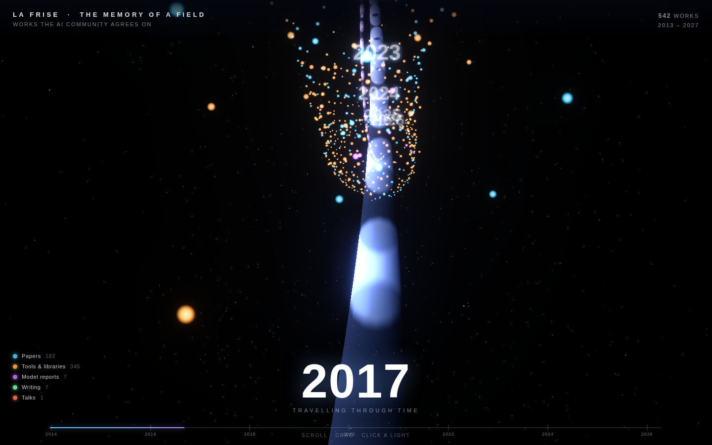

# La Frise Chronologique — A Chronological Atlas of AI

An interactive Three.js visualization of the works the AI community quietly
**agrees** are important. You travel down a meandering *river of time* from
2013 to today; every light is a document, and the ones many different people
independently chose to keep glow brightest near the river's core.



## The signal

The repo's `data/documents/*.jsonl` snapshots hold, per VIP person, the
documents they collected. There are no shared upvotes to rely on
(`favorites.jsonl` has a single user), so "impactful" is defined as
**cross-person consensus**: a work referenced in the collections of many
*different* people.

`build_timeline_data.py` groups near-identical documents by
`(normalised title, year)`, unions the set of people referencing each, and
keeps works cited by **≥ 5 distinct people** (542 works, 2013–2026). It strips
citation-infrastructure noise (DBLP, Scopus, …), error/login pages, and
arXiv-id date artifacts.

Each work carries: `title, date, year, people` (consensus count), `names`
(who cited it), `type` (paper / tool / model / blog / talk / post), `url`,
`source`, `summary`, `tags`.

## The visualization (`index.html`)

- **Time = depth.** A `CatmullRom` river winds into the distance; camera flies
  forward through the years on a rail with mouse parallax.
- **Consensus = position + brightness.** Golden-angle layout places the most
  widely-cited works near the luminous core, rarer ones drift outward.
- **Type = colour.** Papers (cyan), tools (amber), model reports (violet),
  writing (green), talks, posts.
- Custom GLSL point shader (pulsing glow), an additive flowing **time-river**
  ribbon, a twinkling starfield, fog, and **UnrealBloom** post-processing.
- Year monuments, a live year HUD, a timeline scrubber, a clickable legend
  that filters by type, hover tooltips, and a detail panel (summary, the
  people who cited it, tags, source link).

Controls: **scroll / drag / arrow keys** to travel · **hover** a light ·
**click** to open its story · click legend entries to filter.

## Run

It's a static page. Regenerate the data, then serve the folder:

```bash
python3 web/build_timeline_data.py     # writes web/data.json
python3 -m http.server -d web 8000     # open http://localhost:8000
```

Three.js (r160) loads from a CDN via an import map, so the page needs network
access on first load.
